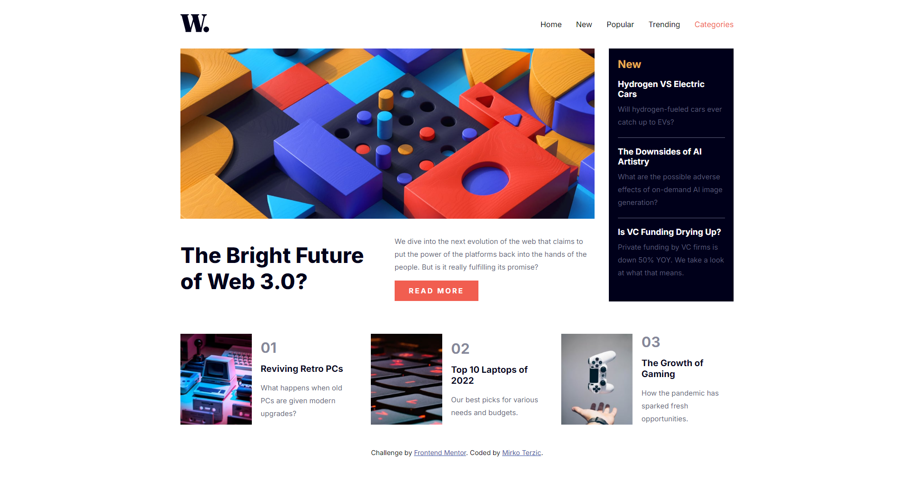

# News Homepage

This project is a responsive news homepage layout challenge from [Frontend Mentor](https://www.frontendmentor.io/challenges). It features a navigation menu, a showcase of the latest news, and a set of cards highlighting trending topics. The layout adjusts for different screen sizes using CSS media queries.

## Table of Contents

- [Overview](#overview)
  - [Screenshots](#screenshots)
  - [Links](#links)
- [Features](#features)
- [Built With](#built-with)
- [Getting Started](#getting-started)
  - [Installation](#installation)

## Overview

### Screenshots

#### Desktop View


- **Description:** The desktop view showcases the full layout, including the navigation bar, the main news article, and additional trending news sections. The layout is optimized for larger screens, making use of Grid and Flexbox for a balanced structure.

#### Mobile View


- **Description:** The mobile view adapts the layout for smaller screens, featuring a collapsible menu and stacked content to ensure readability and ease of navigation. The design is fully responsive, providing a seamless user experience across devices.

### Links

- Solution URL: [Frontend Mentor Solution](https://www.frontendmentor.io/solutions/responsive-landing-page-with-html-css-and-javasript-jBci-q8_XA)
- Live Site URL: [GitHub Pages](https://mirkoterzic.github.io/News-Hompage/)

## Features

- Responsive design with flexible navigation and layout
- Modern CSS using Grid and Flexbox
- Dynamic mobile menu with JavaScript
- Structured and semantic HTML
- Compatibility with various screen sizes

## Built With

- HTML5
- CSS3 (Grid, Flexbox)
- JavaScript
- [Google Fonts - Inter](https://fonts.google.com/specimen/Inter)

## Getting Started

### Installation

1. Clone the repository:

   ```bash
   git clone https://github.com/your-github-username/news-homepage.git

   
## Author

**Name:** Mirko Terzic  
**GitHub:** [mirkoterzic](https://github.com/mirkoterzic)  
**Frontend Mentor Profile:** [Mirko Terzic](https://www.frontendmentor.io/profile/MirkoTerzic)  
**LinkedIn:** [Mirko Terzic](https://www.linkedin.com/in/mirkoterzic/)  
**LeetCode:** [Mirko Terzic](https://leetcode.com/u/mirko_terzic/)

